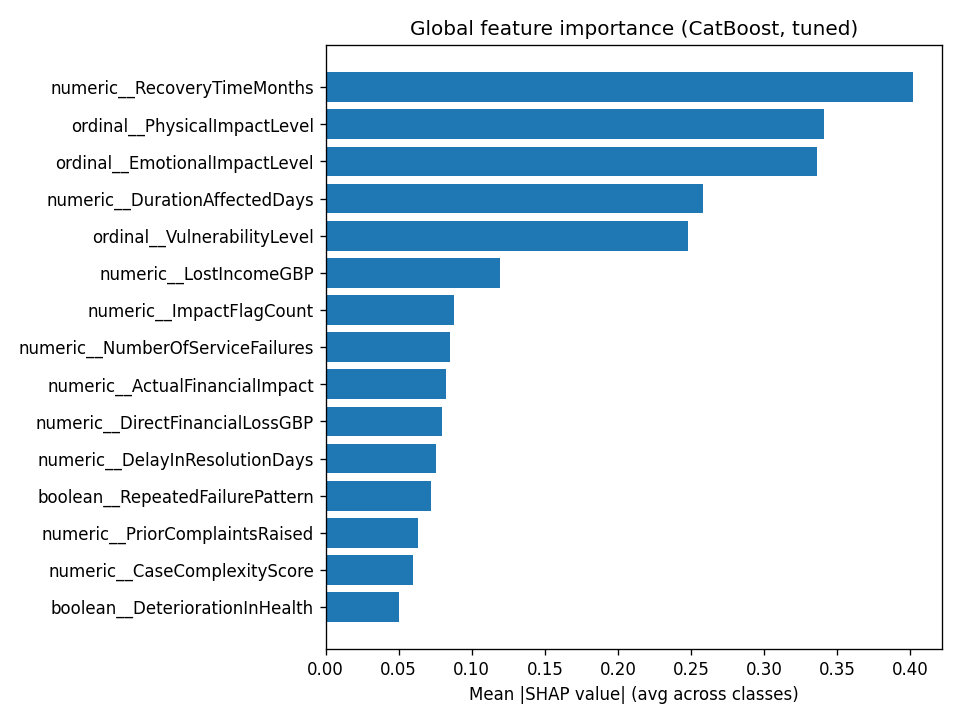

# Phase 4: Explainability and Error Analysis

## Global feature importance (mean |SHAP|, averaged across classes)

|                                        |   mean_abs_shap |
|:---------------------------------------|----------------:|
| numeric__RecoveryTimeMonths            |          0.4016 |
| ordinal__PhysicalImpactLevel           |          0.3412 |
| ordinal__EmotionalImpactLevel          |          0.3363 |
| numeric__DurationAffectedDays          |          0.2579 |
| ordinal__VulnerabilityLevel            |          0.2479 |
| numeric__LostIncomeGBP                 |          0.1191 |
| numeric__ImpactFlagCount               |          0.0882 |
| numeric__NumberOfServiceFailures       |          0.0851 |
| numeric__ActualFinancialImpact         |          0.0822 |
| numeric__DirectFinancialLossGBP        |          0.0799 |
| numeric__DelayInResolutionDays         |          0.0757 |
| boolean__RepeatedFailurePattern        |          0.072  |
| numeric__PriorComplaintsRaised         |          0.0635 |
| numeric__CaseComplexityScore           |          0.0601 |
| boolean__DeteriorationInHealth         |          0.05   |
| ordinal__EvidenceStrength              |          0.0461 |
| numeric__NumberOfOrganisationsInvolved |          0.0423 |
| numeric__FailureBurden                 |          0.0423 |
| boolean__AdditionalTreatmentRequired   |          0.0396 |
| numeric__AdditionalCostsGBP            |          0.03   |

## Error analysis: false negatives (genuinely severe, missed)

Out-of-fold false negatives: 141 of 601 truly severe cases (23.5%) were missed by the default argmax decision. These are the dangerous errors the business explicitly wants minimised -- this is exactly why Phase 3's threshold analysis lowers the decision threshold below 0.5.

### Numeric feature comparison: false negatives vs correctly-caught severe cases

|                         |   false_negative_mean |   true_positive_mean |
|:------------------------|----------------------:|---------------------:|
| DurationAffectedDays    |                  89.2 |                197.7 |
| NumberOfServiceFailures |                   2.3 |                  2.8 |
| DirectFinancialLossGBP  |                 528.4 |                671.7 |
| CaseComplexityScore     |                   5.5 |                  6.2 |
| ActualFinancialImpact   |                 985.2 |               1374   |
| ImpactFlagCount         |                   1.7 |                  2.4 |

### Categorical distribution comparison

**VulnerabilityLevel**

| VulnerabilityLevel   |   false_negative_share |   true_positive_share |
|:---------------------|-----------------------:|----------------------:|
| Moderate             |                  0.348 |                 0.341 |
| High                 |                  0.291 |                 0.285 |
| Low                  |                  0.241 |                 0.267 |
| None                 |                  0.121 |                 0.107 |

**PrimaryVulnerability**

| PrimaryVulnerability    |   false_negative_share |   true_positive_share |
|:------------------------|-----------------------:|----------------------:|
| Physical Health         |                  0.273 |                 0.291 |
| Mental Health           |                  0.205 |                 0.188 |
| Caring Responsibilities |                  0.144 |                 0.122 |
| Learning Disability     |                  0.129 |                 0.119 |
| None                    |                  0.114 |                 0.112 |
| Homelessness            |                  0.068 |                 0.032 |
| Financial Hardship      |                  0.068 |                 0.135 |

**ComplaintCategory**

| ComplaintCategory    |   false_negative_share |   true_positive_share |
|:---------------------|-----------------------:|----------------------:|
| Communication        |                  0.184 |                 0.172 |
| Administrative Error |                  0.142 |                 0.152 |
| Delay                |                  0.142 |                 0.178 |
| Clinical Decision    |                  0.142 |                 0.183 |
| Incorrect Advice     |                  0.135 |                 0.102 |
| Service Quality      |                  0.113 |                 0.124 |
| Lost Information     |                  0.085 |                 0.054 |
| Eligibility Decision |                  0.057 |                 0.035 |

**ServiceArea**

| ServiceArea    |   false_negative_share |   true_positive_share |
|:---------------|-----------------------:|----------------------:|
| Acute Care     |                  0.273 |                 0.222 |
| Primary Care   |                  0.129 |                 0.131 |
| Mental Health  |                  0.115 |                 0.138 |
| Social Care    |                  0.101 |                 0.069 |
| Immigration    |                  0.086 |                 0.042 |
| Community Care |                  0.079 |                 0.116 |
| Benefits       |                  0.065 |                 0.096 |
| Taxation       |                  0.058 |                 0.053 |
| Housing        |                  0.05  |                 0.056 |
| Justice        |                  0.043 |                 0.078 |

### Severe-case recall by actual severity (default argmax decision)

|   ActualSeverityScore |   n_cases |   n_missed_by_default_argmax |   recall |
|----------------------:|----------:|-----------------------------:|---------:|
|                     4 |       297 |                          109 |    0.633 |
|                     5 |       203 |                           30 |    0.852 |
|                     6 |       101 |                            2 |    0.98  |

Recall is lowest for ActualSeverityScore=4 (the boundary class, hardest to separate from 3) and improves for the more extreme 5/6 cases, as expected -- but a 5 or 6 predicted as 3 or below is still a serious error under this model. Top 5 worst individual misses (largest actual-vs-predicted gap, actual >= 5, predicted <= 3):

| CaseReference   |   SeverityScore |   PredictedSeverityScore |   gap |   DurationAffectedDays |   NumberOfServiceFailures |   DirectFinancialLossGBP |   CaseComplexityScore |   ActualFinancialImpact |   ImpactFlagCount |
|:----------------|----------------:|-------------------------:|------:|-----------------------:|--------------------------:|-------------------------:|----------------------:|------------------------:|------------------:|
| TRN-000430      |               6 |                        3 |     3 |                     81 |                         1 |                    250   |                     6 |                   815   |                 3 |
| TRN-001013      |               5 |                        2 |     3 |                     54 |                         1 |                    120   |                     6 |                   268   |                 2 |
| TRN-001866      |               6 |                        3 |     3 |                    112 |                         5 |                    236.5 |                     7 |                   521.6 |                 1 |
| TRN-000154      |               5 |                        3 |     2 |                     76 |                         2 |                    156.3 |                     4 |                   589.9 |                 2 |
| TRN-000217      |               5 |                        3 |     2 |                     97 |                         4 |                    287.1 |                     6 |                   602   |                 2 |

## Probability calibration

Brier score for P(SeverityScore >= 4), out-of-fold: **0.1067** (lower is better, 0 = perfect). Class prevalence here is imbalanced (30.0% severe), so the standard 0.25 'uninformative' benchmark (which assumes a balanced problem) doesn't apply directly; the more relevant baseline is a model that always predicts the training prevalence (0.300), which scores 0.2102. The model's 0.1067 is well below that baseline.

Reliability table (predicted probability vs observed severe rate, 10 quantile bins, out-of-fold):

|   mean_predicted_probability |   observed_severe_fraction |
|-----------------------------:|---------------------------:|
|                        0.004 |                      0     |
|                        0.018 |                      0     |
|                        0.046 |                      0.015 |
|                        0.096 |                      0.03  |
|                        0.169 |                      0.175 |
|                        0.279 |                      0.165 |
|                        0.421 |                      0.35  |
|                        0.618 |                      0.6   |
|                        0.798 |                      0.755 |
|                        0.936 |                      0.915 |

CatBoost's probabilities are used here as a **ranking/decision score** for the threshold analysis, not as independently calibrated probabilities of severity -- tree ensembles are commonly miscalibrated, and no calibration step (e.g. Platt scaling, isotonic regression) has been applied. The reliability table above gives a rough sense of how close the raw scores are to true frequencies; treat `PredictedSevereProbability` in the output file as indicative, not as a precise probability.
